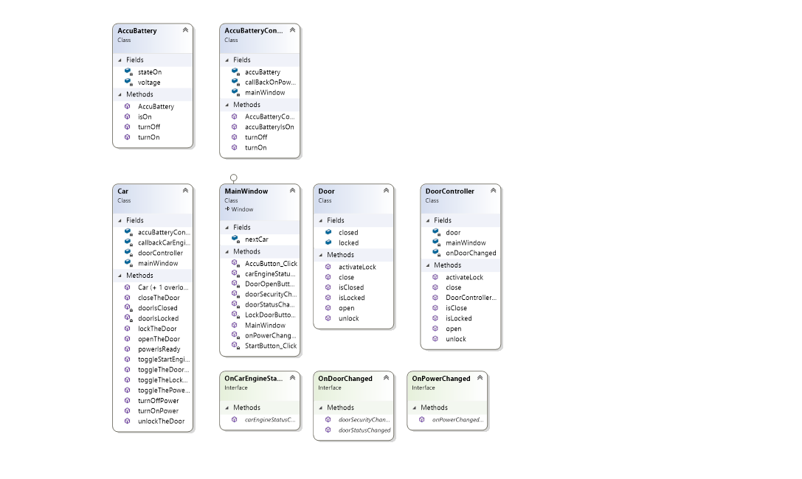

# The Nex Car
Aplikasi sederhana yang menerapkan konsep MVC

## Scope and Functionalities
* User dapat mgnklik tombol
* User dapat melihat perubahan pada tampilan aplikasi

## How Does it works?
1. Class Diagram  

2. Kegunaan `DoorController.cs`  
   `DoorController.cs` adalah class yang digunakan untuk mengontrol dan mengolah data yang telah disediakan 
oleh model `Door.cs` . Terdapat beberapa function, seperti `close ()` untuk menutup pintu, 
`open ()` untuk membuka pintu, `activateLock ()` untuk mengunci dan membuka kunci pintu, 
`isClose () dan isLocked ()` untuk mengecek pint tertutup atau tidak dan mengecek apakah pintu terkunci atau tidak.
3. Kegunaa `Door.cs`  
Fungisnya adalah untuk menyediakan data yang akan diolah nantinya oleh `DoorController.cs`, class ini akan mengembalikan nilai true/false
sesuai dengan fungsi `isClose ()` atau `isLocked ()`.
4. Kegunaan Interface `OnDoorChanged`
Fungsinya untuk memberi tahu status changed dan security changed dari door, yang akan menerima 2 parameter yaitu
value dan message yang berupa string.